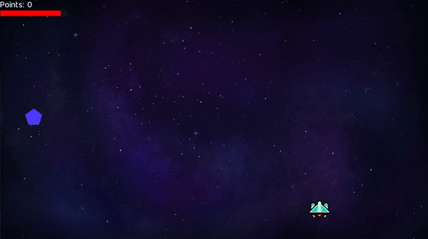

# Space-Shooter-Game
## A simple 2D space shooter game created using C++ and the SFML library.
---
### What it looks like

### This game only has one state

- Game Play State: where the player plays the game
- /* Future games will include additional states: main menu, paused, amd game over. */

### Features

- Ship can be controlled with WASD keys, respectively.
- Ship fires bullets when Spacebar is pressed.
- Asteroids randomly spawn above the screen and move downwards.
- Smaller asteroids move quicker, award more points when destroyed, and deal small damage upon colliding with the player.
- Larger asteroids move slower, award less points when destroyed, but deal more damage to players upon collision.
- Points are awarded when the player shoots an asteroid.
- Players lose health points when they collide with an asteroid or fail to destroy it before it leaves the screen.

### Build Instructions

- Clone and run on a C++ compiler.
